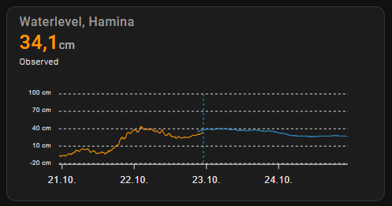

# FMI data for Home Assistant

## What is it?

A custom component that integrates with Finnish Meteorological Institute to retrieve data not typically part of
other weather integrations, such as seawater level, UV-index, snow thickness etc.

## Installation

### With HACS

1. Add this repository to HACS custom repositories
2. Search for FMI in HACS and install with type integration
3. Restart Home Assistant
4. Enter your account credentials and configre other settings as you wish

### Manual

1. Download source code from latest release tag
2. Copy custom_components/fmi folder to your Home Assistant installation's config/custom_components folder.
3. Restart Home Assistant
4. Configure the integration by adding a new integration in settings/integrations page of Home Assistant

### Integration settings

Configuring the integration to retrieve query data requires that you know what ID types and values can be used
for which observation/forecast types. The wizard shows explanations and URLs for each step on how to find out
the correct values.

## Step 1

| Name        | Type | Requirement  | Description                                                           | Default    |
|-------------|------| ------------ |-----------------------------------------------------------------------|------------|
| language    | enum | **Required** | Language selection (eng/fin)                                          | `eng`      |

# Step 2

| Name        | Type   | Requirement  | Description             | Default                           |
|-------------|--------| ------------ |-------------------------|-----------------------------------|
| query_label | enum   | **Required** | Chosen query type       | `fmi::observations::wave::simple` |
| target_type | enum   | **Required** | Type of identifier used | `fmisid`                          |
| target      | string | **Required** | Identifier value        |                                   |

# Step 3

| Name                | Type   | Requirement  | Description                                                               | Default |
|---------------------|--------| ------------ |---------------------------------------------------------------------------|---------|
| label               | string | **Required** | Nane for the created sensor                                               |         |
| parameter           | string | **Required** | Which parameter from query data to use                                    |         |
| forecast_step       | int    | **Required** | Step between two values in minutes. Only shown for forecast type queries. | 30      |
| forecast_hours      | int    | **Required** | How many hours of forecasts to retrieve (starting from current time)      | 36      |
| forecast_past_hours | int    | **Required** | How many past hours of forecasts to retrieve (starting from current time) | 5       |


### State attributes

All sensors return the following extra attributes.

| Name      | Type     | Description                              |
|-----------|----------|------------------------------------------|
| latitude  | float    | Latitude of the observation station      |
| longitude | float    | Longitude of the observation station     |
| query_id  | string   | Query ID set when configuring the sensor |
| parameter | string   | Name of the returned parameter           |

Additionally, observation type sensors return the following extra attributes.
Observation type sensors return the latest known value as sensor state.

| Name   | Type     | Description                     |
|--------|----------|---------------------------------|
| time   | datetime | Time of the latest observation  |
| value  | string   | Value of the latest observation |

Additionally, forecast type sensors return the following extra attributes.
Forecast type sensors return the next known forecast value as sensor state.

| Name          | Type             | Description                                                       |
|---------------|------------------|-------------------------------------------------------------------|
| forecast      | [{date, string}] | List of forecast values as objects containing time and value keys |

### Usage with apexcharts-card

One example use case for this integration could be to show waterlevel values with [apexcharts-card](https://github.com/RomRider/apexcharts-card).

Below is an example configuration for showing waterlevels (2 days of observations and 2 days of forecasts, 2 hour overlap).
Same kind of configuration could of course be used for other observation/forecast types aswell.



```
type: custom:apexcharts-card
graph_span: 4d
span:
  offset: +2d
now:
  show: true
header:
  show: true
  title: Waterlevel, Hamina
  show_states: true
  colorize_states: true
all_series_config:
  curve: straight
apex_config:
  chart:
    height: 150px
  legend:
    show: false
  xaxis:
    labels:
      format: dd.MM.
series:
  - entity: sensor.fmi_waterlevel_hamina
    transform: return x/10
    stroke_width: 1
    float_precision: 3
    yaxis_id: waterlevel
    name: Mitattu
    color: orange
    unit: cm
    extend_to: now
  - entity: sensor.fmi_waterlevel_forecast_hamina
    data_generator: |
      return entity.attributes.forecast.map((entry) => {
        return [entry["time"], entry["value"]];
      });
    stroke_width: 1
    float_precision: 3
    yaxis_id: waterlevel
    show:
      in_header: false
yaxis:
  - id: waterlevel
    min: ~-20
    max: ~100
    apex_config:
      tickAmount: 4
      labels:
        style:
          fontSize: 8px
        formatter: |
          EVAL:function(value) {
            return value.toFixed(1) + ' cm'; 
          }
```